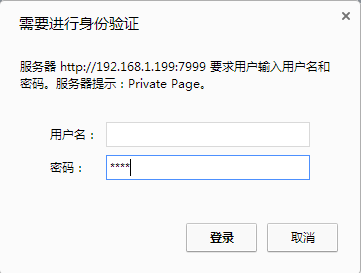

在当前的项目中，我们做了虚拟电视机设备，手机应用必须连接并通过认证才能控制电视机。认证步骤如下，首先由手机应用向电视机发送认证请求，电视机收到后会显示PIN码，用户在手机应用中输入PIN码，再发送请求验证即可。  

其中一种认证实现，我们采用了WWW-Authenticate，这种在互联网初期比较常见的认证方式。优点是非常简单，标准化的，浏览器支持完善。缺点是用户名和密码是经Base64编码传输。大家都知道Base64就是个简单的障眼法，是那种防君子不防小人的做法。解密过程特别简单，与明文传输基本无异。  

下面就简单描述一下过程吧。  

1. 浏览器向电视机（服务器端，下同）发送请求。
```
POST http://192.168.1.199:7999/sony/3/accessControl HTTP/1.1
```
  
2. 电视机没有收到认证信息，创建PIN码并显示在电视机上（如下图），返回401未认证错误。
```
HTTP/1.1 401 Unauthorized
WWW-Authenticate: Basic realm="Private Page"
```  

  
3. 浏览器收到401未认证错误，将会显示一个如下登录框。并显示出服务器端给的提示信息`Private Page`.  
  
用户在密码一栏中输入PIN码之后点击登录，浏览器将会重新再发一次请求。这次请求跟上次请求唯一不同就是多了一个header。
```
POST http://192.168.1.199:7999/sony/3/accessControl HTTP/1.1
Authorization: Basic OjgyNzU=
```
我们在Chrome的控制台执行以下代码`atob('OjgyNzU=')`，可以看到结果是`:8275`，也就是`: + PIN`。也许你已经猜到了，Authorization的值就是`Basic base64(<username>:<password>)`。  

4. 电视机收到带有Authorization头部的请求以后，调用类似`atob`的方法解码，得到PIN码判断是否正确，如果正确则验证成功，如果不正确则继续返回和第2步一样的响应。在这里，我们输入了正确的PIN码，所以服务器端返回了200状态吗。
```
HTTP/1.1 200 OK
Set-Cookie: auth=0757981464307829417712055147089187584491446610025428754976019263; path=/; max-age=1209600; expires=Fri Sep 20 2013 17:09:39 GMT
```
以上这种方法的客户端并不一定要是浏览器，在手机原生应用中也可以做到，一般需要HTTP客户端库来辅助发送请求并解析响应。当然还需要自己做一个登录框。  